# 📒 Notey – Cloud-Native Notes Management Application

## Overview

Notey is a cloud-native full-stack web application deployed on **Amazon Web Services (AWS)** using a **Three-Tier Architecture**. The project demonstrates **High Availability**, **Fault Tolerance**, **Auto Scaling**, and secure cloud deployment using **Amazon EC2**, **Amazon S3**, **Amazon RDS**, **Application Load Balancer (ALB)**, and **Auto Scaling Group (ASG)**.

The backend is built with **Spring Boot** and deployed on **Amazon EC2**, while the frontend is developed using **HTML**, **CSS**, and **JavaScript** and hosted on **Amazon S3 Static Website Hosting**. Application data is stored in **Amazon RDS MySQL**, and PDF attachments are securely stored in **Amazon S3**.
# Project Objectives

- Develop a full-stack cloud-native notes management application.
- Deploy the frontend and backend on AWS.
- Store application data in Amazon RDS and PDF files in Amazon S3.
- Design a Three-Tier Architecture with High Availability and Auto Scaling.
- Secure AWS resources using IAM Roles and Security Groups.
- Gain hands-on experience with AWS cloud deployment and architecture.

# Architecture Diagram

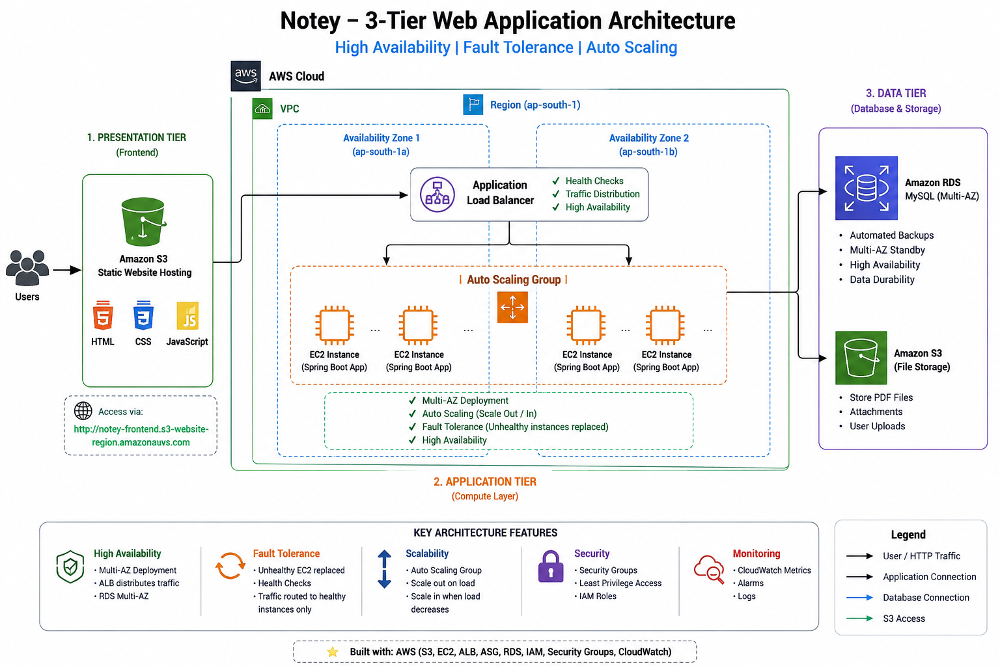

### Architecture Description

The application follows a **Three-Tier Architecture** consisting of Presentation, Application, and Data layers.

### Request Flow

1. Users access the frontend hosted on Amazon S3.
2. Requests are forwarded to the Application Load Balancer (ALB).
3. The ALB distributes incoming traffic across EC2 backend instances running in multiple Availability Zones.
4. Auto Scaling Group continuously monitors instance health and replaces unhealthy instances automatically.
5. The Spring Boot backend processes application requests.
6. User data is stored in Amazon RDS MySQL.
7. PDF attachments are uploaded to and retrieved from Amazon S3.

This architecture ensures scalability, high availability, and fault tolerance.

---

# Project Implementation

## Step 1: Getting Started

### Explore the Project

Feel free to clone this repository, explore the source code, and use it as a learning resource for building and deploying cloud-native applications on AWS.

```bash
git clone https://github.com/your-username/notey.git
```


## Step 2: Configuring Amazon RDS

Amazon RDS MySQL was configured to store user accounts and notes securely.

### Amazon RDS

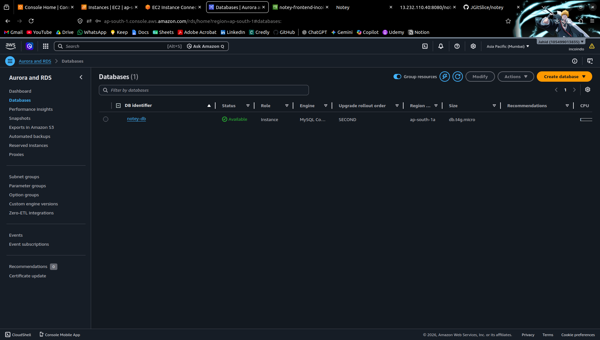

The database serves as the primary data storage layer for the application.


## Step 3: Configuring Amazon S3

Amazon S3 was configured for two purposes:

- **Static Website Hosting** for the frontend.
- **Object Storage** for uploaded PDF files.

<p align="center">
  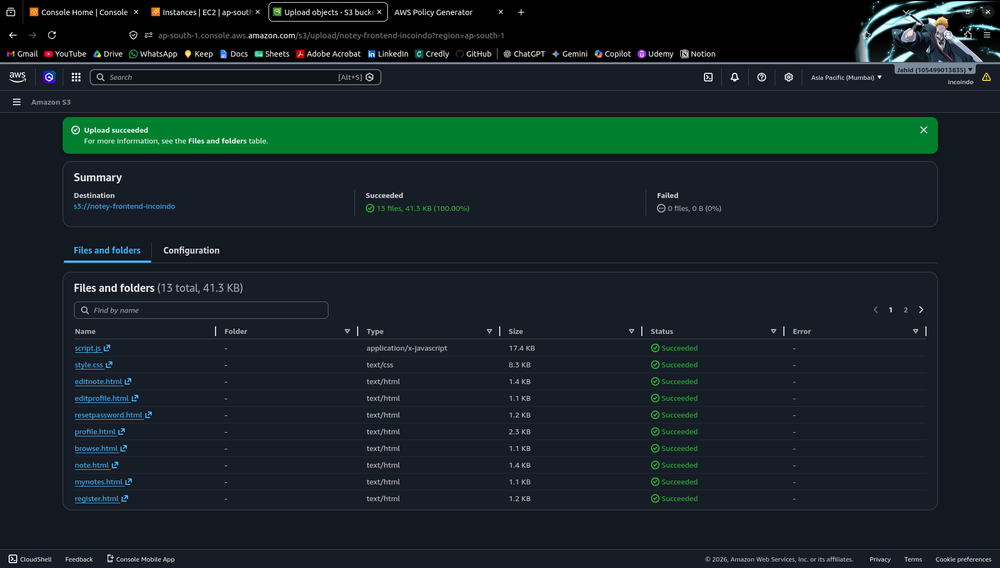<br>
  <strong>Frontend Hosting Bucket</strong><br><br>
</p>

<p align="center">
  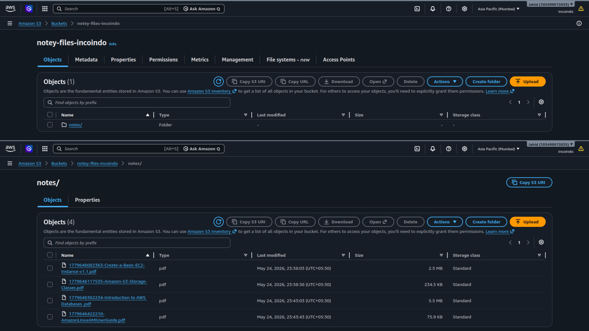<br>
  <strong>PDF Storage Bucket</strong>
</p>

The **frontend bucket** hosts the static website files (HTML, CSS, and JavaScript), while the **files bucket** securely stores PDF attachments uploaded by users.


## Step 4: Deploying Backend on Amazon EC2

The Spring Boot backend was deployed on an Amazon EC2 instance running Ubuntu.

### EC2 Instance

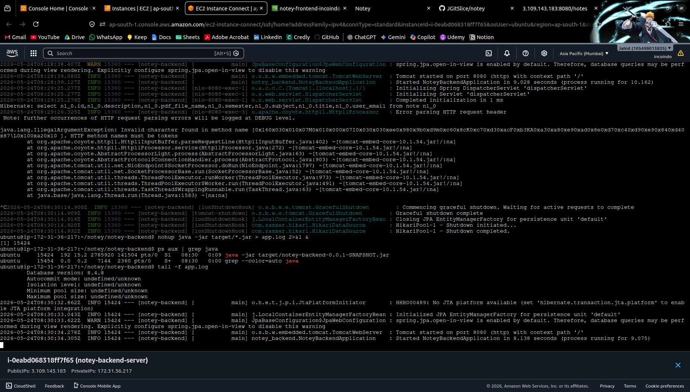

The backend application communicates with Amazon RDS and Amazon S3.


## Step 5: Configuring IAM Role

An IAM Role was attached to the EC2 instance to securely access Amazon S3 without storing AWS credentials inside the application.

### IAM Role

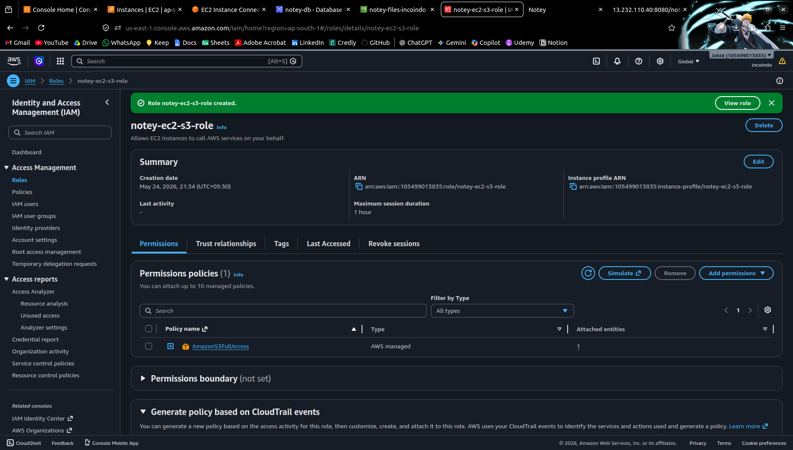

IAM Roles provide secure and temporary AWS credentials.


## Step 6: Hosting the Frontend

The frontend was hosted using Amazon S3 Static Website Hosting.

### Static Website Hosting

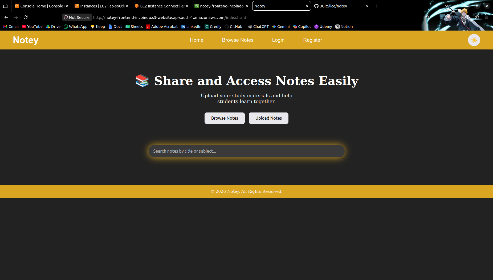

Users access the application directly through the S3 static website endpoint.


## Step 7: Implementing Three-Tier Architecture

The application was redesigned into a Three-Tier Architecture.

### Architecture


The architecture separates:

- Presentation Layer
- Application Layer
- Data Layer

This improves maintainability, scalability, and security.


## Step 8: Implementing High Availability

To eliminate a single point of failure, the backend was deployed using:

- Application Load Balancer
- Multi-AZ deployment
- Target Groups
- Health Checks

### Application Load Balancer

<p align="center">
  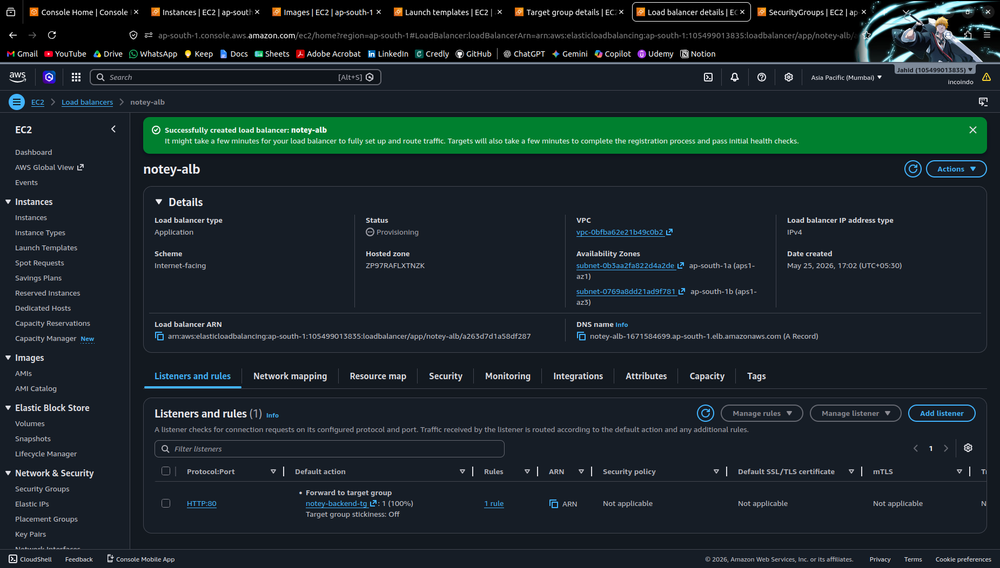<br>
  <strong>Application Load Balancer (ALB)</strong><br><br>
</p>

<p align="center">
  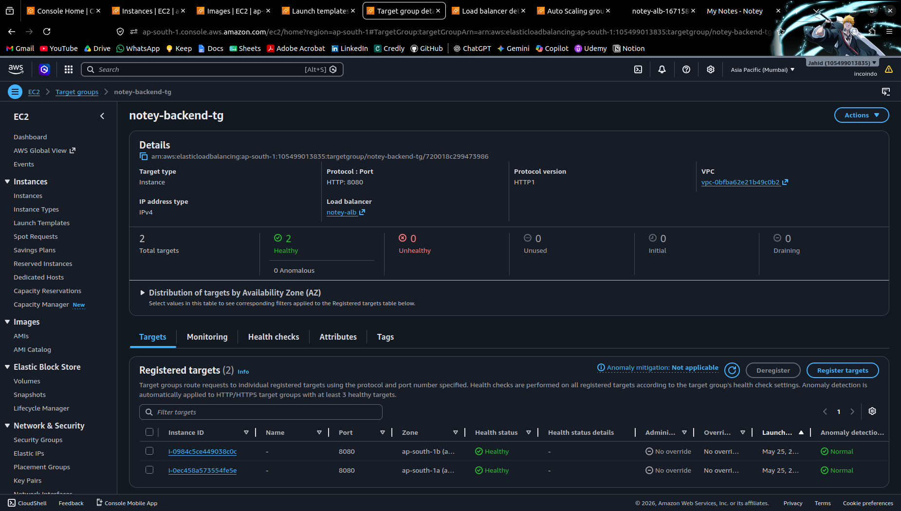<br>
  <strong>Target Group</strong>
</p>

Traffic is automatically distributed among healthy backend instances.


## Step 9: Implementing Auto Scaling

Auto Scaling was configured to improve fault tolerance.

The following AWS services were used:

- Amazon Machine Image (AMI)
- Launch Template
- Auto Scaling Group

### Auto Scaling Group

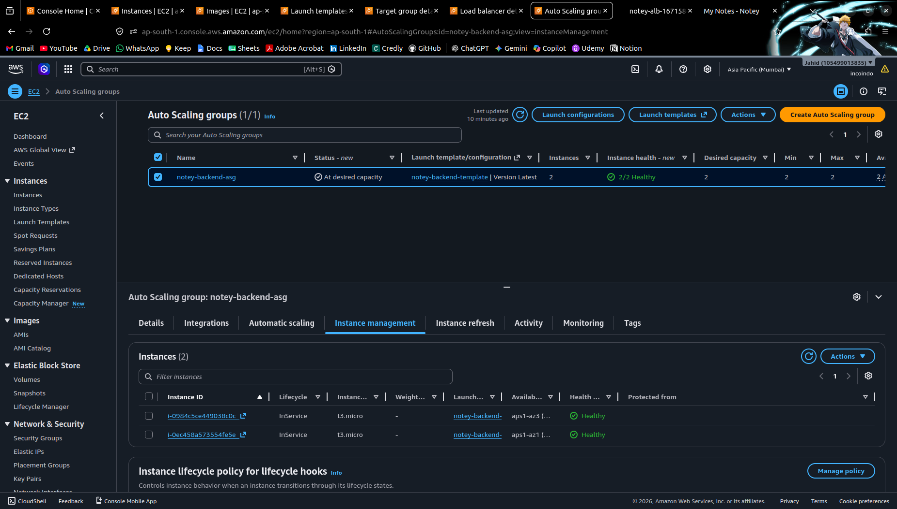

When an instance becomes unhealthy, Auto Scaling automatically launches a replacement instance.


## Step 10: Application Demonstration

<p align="center">
  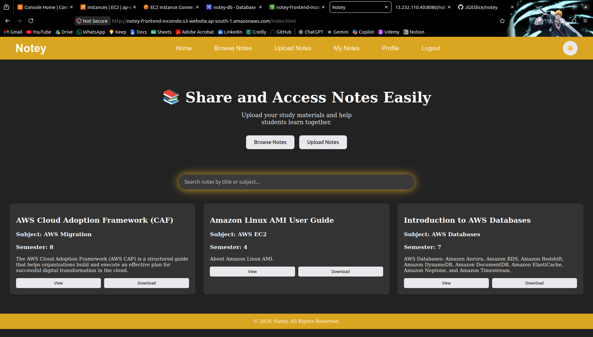<br>
  <strong>Home Page</strong><br><br>
</p>

<p align="center">
  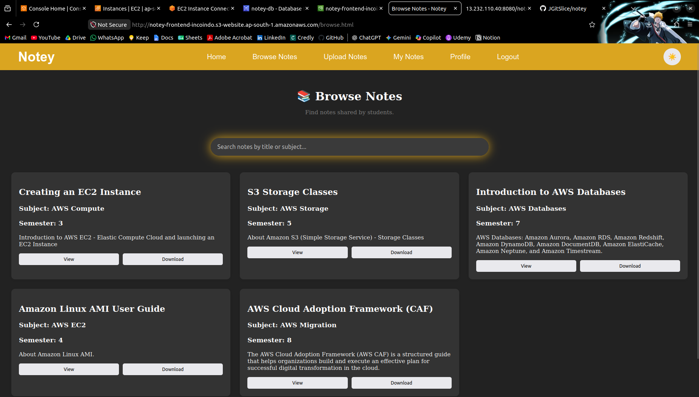<br>
  <strong>Browse Notes Page</strong><br><br>
</p>

<p align="center">
  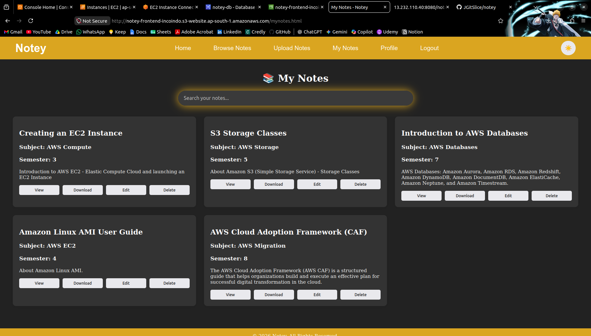<br>
  <strong>My Notes Page</strong><br><br>
</p>

<p align="center">
  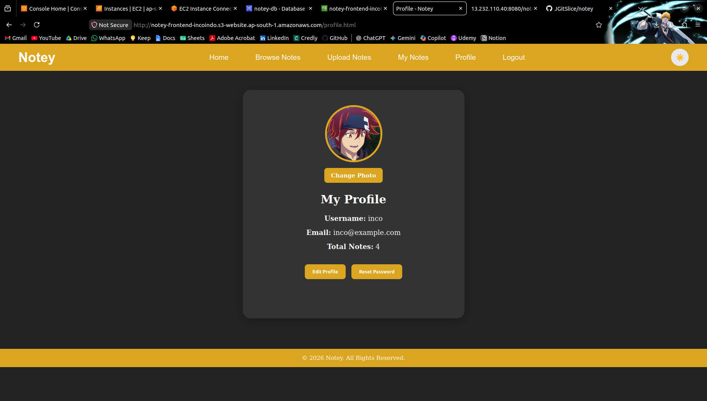<br>
  <strong>Profile Page</strong><br><br>
</p>

<p align="center">
  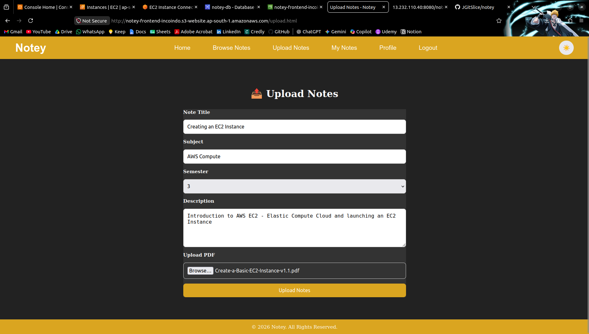<br>
  <strong>Upload Notes Page</strong><br><br>
</p>

<p align="center">
  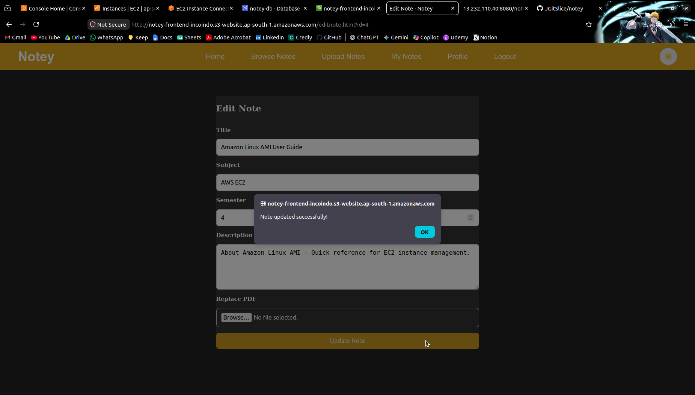<br>
  <strong>Update Notes Page</strong>
</p>

---

# AWS Services Used

| Service | Purpose |
|----------|----------|
| Amazon EC2 | Backend Hosting |
| Amazon S3 | Static Website Hosting & PDF Storage |
| Amazon RDS MySQL | Database |
| Application Load Balancer | Traffic Distribution |
| Auto Scaling Group | High Availability & Fault Tolerance |
| Launch Template | Auto Scaling Configuration |
| Amazon Machine Image (AMI) | Backend Image |
| IAM Roles | Secure AWS Access |
| Security Groups | Network Security |

---

# Tech Stack

## Frontend

- HTML5
- CSS3
- JavaScript

## Backend

- Java
- Spring Boot
- Spring Data JPA
- Maven

## Database

- MySQL

## Cloud

- Amazon EC2
- Amazon S3
- Amazon RDS
- Application Load Balancer
- Auto Scaling Group
- IAM
- Security Groups

---

# Key Features

- User Registration & Login
- Create, Edit & Delete Notes
- PDF Upload Support
- Amazon S3 Integration
- Amazon RDS Integration
- RESTful APIs
- Static Website Hosting
- Three-Tier Architecture
- High Availability
- Fault Tolerance
- Multi-AZ Deployment
- Auto Scaling
- Production-style AWS Deployment

---

# 🚧 Challenges & Solutions

- **Auto Scaling Health Checks:** Created a new AMI, configured a Launch Template, and enabled backend auto-start using `systemd`.
- **EC2 Memory Issues:** Configured swap memory for stable application startup.
- **RDS Connectivity:** Updated Security Groups to allow secure communication between EC2 and RDS.
- **Load Balancer Setup:** Configured Target Groups and Health Checks to ensure traffic reached only healthy instances.

# Project Outcome

The project was successfully designed, deployed, and tested on AWS using cloud-native architecture.

### Achievements

- Developed a full-stack notes management application.
- Hosted the frontend using Amazon S3.
- Deployed the backend on Amazon EC2.
- Configured Amazon RDS MySQL.
- Integrated Amazon S3 for PDF storage.
- Designed a Three-Tier Architecture.
- Implemented High Availability.
- Configured Application Load Balancer.
- Configured Auto Scaling Groups.
- Achieved Fault Tolerance using Multi-AZ deployment.
- Gained hands-on experience with AWS cloud architecture and deployment.

---

# Future Enhancements

- Dockerize the application
- Deploy using Amazon ECS or Kubernetes (EKS)
- Implement Terraform for Infrastructure as Code
- Add monitoring using Amazon CloudWatch dashboards
- Configure CI/CD using GitHub Actions
- Add HTTPS using AWS Certificate Manager

---

# Author

**Jahid Khan**

- GitHub: https://github.com/your-username
- LinkedIn: https://linkedin.com/in/your-profile

---

## ⭐ If you found this project interesting, consider giving it a star!
